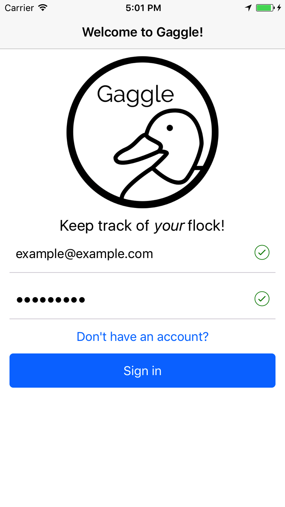
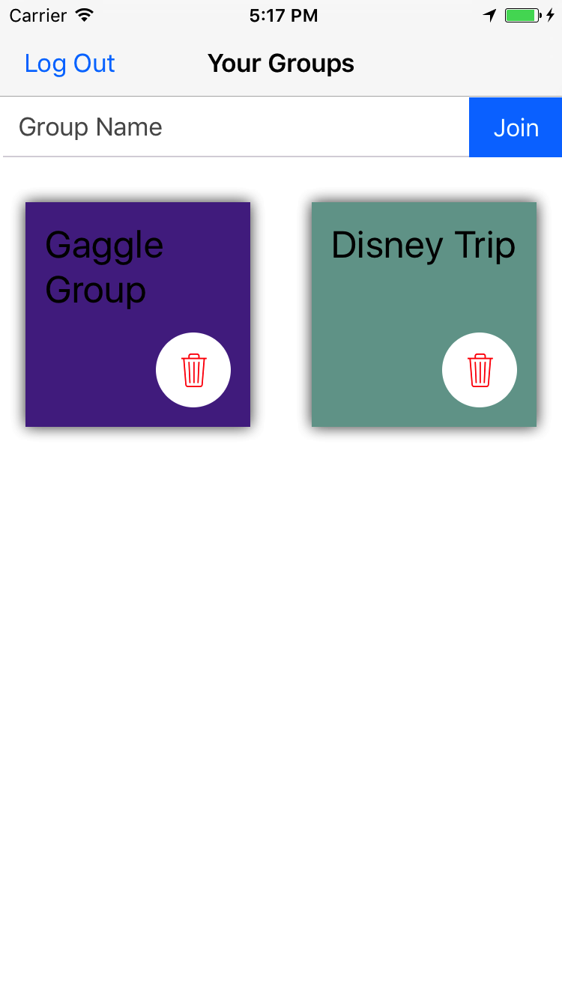

# Gaggle

Have you ever gone on a group trip, whether with friends or family, and wanted to keep everyone on the same page? With Gaggle, you can easily interact with members of your group either by chatting directly, or viewing their locations. You can even set up a poll for suggestions on what to do and see around your area, using the powerful map view.

Gaggle, the best way to keep track of *your* flock!

### Installing

Start of by installing the dependencies with npm.

```
npm install
```

Next, you'll need to make a Firebase project and get your project details for the app. Reference config.example.js and make your own config.js in the same folder, replacing the empty strings with the values from Firebase.

```
export default {
  apiKey: '',
  authDomain: '',
  databaseURL: '',
  storageBucket: '',
  messagingSenderId: '',
};
```
Similar to setting up the Firebase config file, you will need to do the same for the google and uber config files. Navigate to the google and uber directories, and make your own config.js in their respective directories, replacing the empty strings with the appropriate keys.

Google:
```
export default 'GOOGLE_API_KEY';
```
Uber:
```
export const clientID = 'UBER_CLIENT_ID';
```

Then, start up the application with the simulator.

```
react-native run-ios
```

And there you have it! You should see your simulator up with the application running.

## Running the tests

To run the tests, call the test script from the package.json.

```
npm test
```

## Details of the Application

Starting out, you will be prompted to sign in using your email and password. You will notice that both your email and password need to match specific criteria for the sign-in/sign-up button to fill in. Specifically, your password must be 6 characters, or more.




Once you successfully log in, you are brought to your list of groups. You are able to create or join any group, and later remove yourself from them, by clicking the trash can. 

Please note, ANYONE can join your group, as long as they have the exact same spelling as your group. For example, if I create a group named 'Disney Group', and someone learns that I've named my group that, they can also join my group by joining 'Disney Group'.




## Built With

* [React Native](https://facebook.github.io/react-native/) - iOS native framework, using React.
* [Firebase](https://firebase.google.com/) - Authentication, Realtime Database, and overall backend.
* [Native Base](http://nativebase.io/) - For consistent styling and interactions.

## Authors

* **Erica Stephen**
* **Kevin Jang**
* **Gwynn Dandridge-Perry**
* **Maxwell DeMers**

